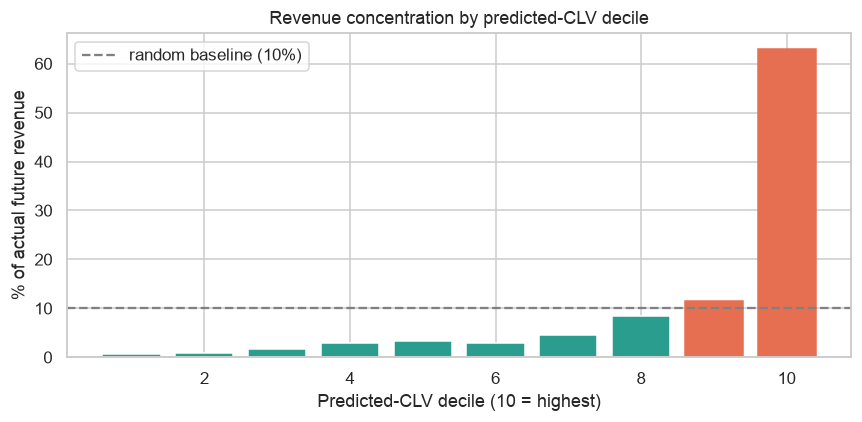
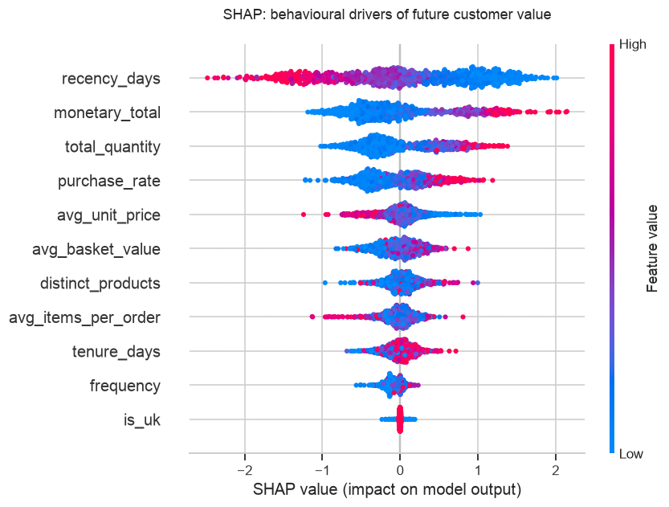

# Predictive Customer Lifetime Value (CLV) Engine


Predicting how much a retail customer will spend over the **next 6 months** from their past purchasing behaviour, and using SHAP to explain *which behaviours drive value* — so CRM teams can spot future high-value customers early and target retention spend where it pays off.

Built on the **real [UCI Online Retail II](https://archive.ics.uci.edu/dataset/502/online+retail+ii) dataset — 1,067,371 transactions** from a UK online retailer (Dec 2009 – Dec 2011).

> **Behavioural angle:** CLV is a behavioural prediction — a customer's recency, frequency and monetary patterns encode their future intent. SHAP turns the model into a ranked, explainable list of *which behaviours drive value*, not just a black-box number.

---

## Results (measured on a held-out test set)

| Metric | XGBoost | Linear baseline |
|--------|--------:|----------------:|
| **MAE** | **£600** | £2,930 |
| **R² (test)** | **0.69** | −118 *(fails)* |
| **5-fold CV R² (log target)** | **0.35 ± 0.03** | — |

**Business impact:** the customers the model ranks in the **top 10% by predicted CLV account for ~63% of all actual future revenue** (a random 10% would capture ~10%); the top 20% capture **~75%**. That is a directly actionable targeting list.



### Why the linear baseline fails
CLV is heavily right-skewed — most customers spend little, a few "whales" spend up to £184k. Squared-error linear regression is dominated by those outliers and returns a large negative R². This motivates a **tree-based model on a `log1p` target**, and it's why I report **MAE and revenue-capture** (robust, business-meaningful) rather than leaning on R² alone.

### What drives customer value (SHAP)


Monetary total, total quantity, recency and purchase cadence are the dominant behavioural drivers — the explainable hierarchy a marketing team can act on.

---

## Methodology
1. **Cleaning** — from 1.07M raw transactions, drop missing customer IDs (~243k), cancellations (`C`-invoices), and returns/bad rows → **805,549 clean transactions (75% retained), 5,878 customers**.
2. **Leakage-safe time split** — features come **only** from an observation window (≤ cutoff); the target is spend in the **disjoint 6-month future window** (£0 for customers who don't return — 48% of them).
3. **Feature engineering** — RFM (recency, frequency, monetary) plus tenure, basket value, product variety, purchase cadence, and a UK flag (see [`src/clv_features.py`](src/clv_features.py)).
4. **Modelling** — `log1p(spend)` target for stability; **XGBoost** vs a **Linear Regression** baseline; **5-fold cross-validation**.
5. **Explainability** — SHAP `TreeExplainer` summary of behavioural drivers.
6. **Business evaluation** — revenue-capture by predicted-CLV decile (the metric a CRM team actually cares about).

## Tech Stack
Python · pandas · NumPy · scikit-learn · XGBoost · SHAP · Matplotlib · Seaborn

---

## Repository Structure
```
├── README.md
├── requirements.txt
├── notebooks/
│   └── predictive_clv_engine.ipynb   # full pipeline with embedded outputs & charts
├── src/
│   └── clv_features.py               # reusable cleaning + feature engineering
├── data/                             # download instructions — see data/README.md
├── images/                           # exported charts
└── docs/
```

## How to Run
```bash
git clone https://github.com/kndukuba17-hub/predictive-clv-engine.git
cd predictive-clv-engine
pip install -r requirements.txt

# Download online_retail_II.xlsx from UCI (see data/README.md) into data/, then:
jupyter notebook notebooks/predictive_clv_engine.ipynb
```
The dataset (~45 MB) is not committed; `data/README.md` has the one-step download link. Runs on Jupyter or Google Colab.

## Roadmap
- Rolling / multi-window validation instead of a single 6-month split.
- Probabilistic CLV benchmark (BG/NBD + Gamma-Gamma) alongside the ML model.
- Streamlit app: enter a customer's RFM profile → predicted CLV + SHAP explanation.
